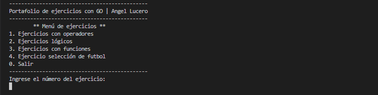

# Portafolio de ejercicios con GO

El proyecto consiste en un portafolio de ejercicios utilizando: operadores aritméticos, relacionales, lógicos, de asignación; conficionales, bucles. Además, ejercicios con razonamiento lógico.

También se ha implementado modularidad dentro del proyecto y se ha construido un ejecutable del mismo.

## Vista previa

El proyecto es por línea de comandos (CLI), al ejecutarse luce de la siguiente manera



## Ejecución

Para ejecutar el proyecto usar las siguentes opciones:

- Si desea correr el código fuente

```bash
go run main.go
```

- Si desea utilizar el ejecutable del proyecto

```bash
main.exe
```

> Los comandos deben ejecutarse en consola

## Autor

Desarrollador por: [Angel Lucero](https://www.linkedin.com/in/angellucero/)
